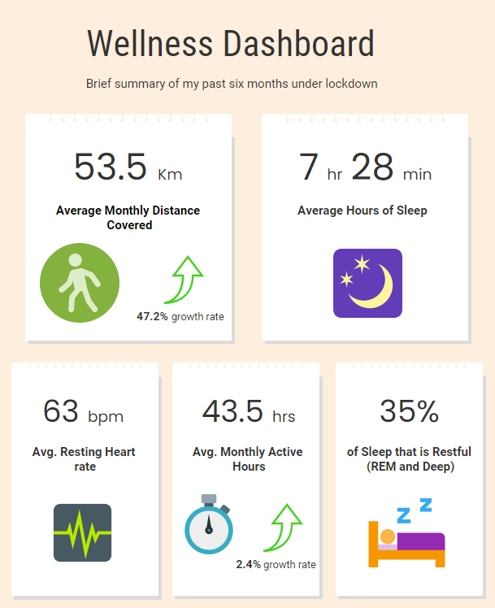

<br></br>
<center>
#  Lockdown Fitness: A FitBit Story `r emo::ji("watch")`
</center>


Being in Germany the past 15 months means a state of endless lockdowns to curb the spread of the virus. While these lockdowns have had some positive results in keeping the waves of spread low in Germany, they have undoubtedly taken physical and mental toll on people. The sense of time, energy and social behaviors have been negatively impacted. While it would be hard to actively track of how one's body reacts to everything, technology has given us tools that can do this for us. 

I am the proud owner of a FitBit Charge 2, which is roughly 5 years old(!?) but still works like a charm. I graduated last year in September, left my student working position, changed cities and experienced my 3rd winter ever. All while going through a pandemic lockdown. Personally, i felt it took its toll, but i wanted to get better insights from my FitBit to analyze just how much the pattern was disrupted. 

Using data visualization i explored:  

1.  How did my daily fitness levels trend between October 2020 and March 2021?
2.  How did my sleep quantity and quality change during the same time period? Is there any relationship between my fitness and my quality of sleep?
3.  How was my heart-rate/health throughout this period? Are the perceptions related to/influenced by the demographics and success metrics of the school?

I utilize my FitBit data that i [exported](https://help.fitbit.com/articles/en_US/Help_article/1133.htm) to try and answer these questions and provide context to key observations. The data comes in JSON format, which can be tricky for some people to parse through. You can uses this [Github page](https://iccir919.github.io/fitbit-json-to-csv/) that helps convert your JSON files to CSV.


```{r setup, include=FALSE, results='hide', message=FALSE, warning=FALSE}

#Loading packages
library(tidyverse)
library(ggplot2)
library(dplyr)
library(corrplot)
library(plotly)
library(ggcorrplot)
library(scales)
library(tufte)
library(lubridate)
library(streamgraph)
library(jsonlite)
library(emo)
library(zoo)
library(viridis)
getwd()

```

```{r sys, include=FALSE}

Sys.setenv("plotly_username"="rickymarvel")
Sys.setenv("plotly_api_key"="RrlUUhrCU8EIF2f840Eb")

```

#### **Data: Importing and Cleaning**

```{r data, include=TRUE, results='hide', message=FALSE, warning=FALSE}
#Load datasets
## Method1: as CSV
alt<-read_csv("C:/Users/ricky/Documents/GitHub/Fitness/Dataset/Altitude.csv")
dis<-read_csv("C:/Users/ricky/Documents/GitHub/Fitness/Dataset/Distance.csv")
hrt1<-read_csv("C:/Users/ricky/Documents/GitHub/Fitness/Dataset/Heartrate1.csv")
hrt2<-read_csv("C:/Users/ricky/Documents/GitHub/Fitness/Dataset/Heartrate2.csv")
lam<-read_csv("C:/Users/ricky/Documents/GitHub/Fitness/Dataset/Light active minutes.csv")
mam<-read_csv("C:/Users/ricky/Documents/GitHub/Fitness/Dataset/Moderate active minutes.csv")
sam<-read_csv("C:/Users/ricky/Documents/GitHub/Fitness/Dataset/Sedentary minutes.csv")
vam<-read_csv("C:/Users/ricky/Documents/GitHub/Fitness/Dataset/Very active minutes.csv")
slp_sc<-read_csv("C:/Users/ricky/Documents/GitHub/Fitness/Dataset/sleep_score.csv")

## Method2: as JSON and turn it into a dataframe
path <- "data/Sleep/"
files <- dir(path, pattern = "*.json")

slp <- files %>%
  map_df(~fromJSON(file.path(path, .), flatten = TRUE))

#Date: Separate date and time (time is not relevant for this analysis)
#Separate date variable
alt<-alt%>%
  separate(Date,
           into=c("date", "time"),
           sep=" ")%>%
  select(-time)  

#Standardize dates and rename variables
alt$date<-mdy(alt$date)
alt<-alt%>%
  rename(altitude=Altitude) 

#Repeat process for all datasets. 
```

The "Date" column is designated as a character in all dataframes. It needs to be converted into in a "Date" data type. Since time is not of importance for this analysis, i decided to separate it, discard it and then convert the dates into correct format. 


Remember to remove columns you feel are not important to your analysis or duplicated across dataframes e.g. sleep_log_entry_id. Filter out low confidence recordings for heartbeat (FitBit defines 0 1nd 1 as low confidence recordings, times when FitBit did not record any values).

```{r clean, include=FALSE, results='hide'}

#Separate date variable
dis<-dis%>%
  separate(Date,
           into=c("date", "time"),
           sep=" ")%>%
  select(-time)

hrt1<-hrt1%>%
  separate(Date,
           into=c("date", "time"),
           sep=" ")%>%
  select(-time)

hrt2<-hrt2%>%
  separate(Date,
           into=c("date", "time"),
           sep=" ")%>%
  select(-time)

lam<-lam%>%
  separate(Date,
           into=c("date", "time"),
           sep=" ")%>%
  select(-time)

mam<-mam%>%
  separate(Date,
           into=c("date", "time"),
           sep=" ")%>%
  select(-time)

sam<-sam%>%
  separate(Date,
           into=c("date", "time"),
           sep=" ")%>%
  select(-time)

vam<-vam%>%
  separate(Date,
           into=c("date", "time"),
           sep=" ")%>%
  select(-time)

slp_sc<-slp_sc%>%
  separate(timestamp,
           into=c("date", "time"),
           sep=" ")%>%
  select(-time, -sleep_log_entry_id, -deep_sleep_in_minutes)

#Standardize dates and rename variables

dis$date<-mdy(dis$date)
dis<-dis%>%
  rename(distance=Distance) 


hrt1$date<-mdy(hrt1$date)
hrt1<-hrt1%>%
  rename(heartrate=Heartrate) 


hrt2$date<-mdy(hrt2$date)
hrt2<-hrt2%>%
  rename(heartrate=Heartrate) 


lam$date<-mdy(lam$date)
lam<-lam%>%
  rename(light_act_mins=`Light active minutes`) 


mam$date<-mdy(mam$date)
mam<-mam%>%
  rename(moderate_act_mins=`Moderate active minutes`) 

sam$date<-mdy(sam$date)
sam<-sam%>%
  rename(sedentary_mins=`Sedentary minutes`)

slp_sc$date<-ymd(slp_sc$date)

vam$date<-mdy(vam$date)
vam<-vam%>%
  rename(very_act_mins=`Very active minutes`) 

#Remove redundant columns
slp$dateOfSleep<-ymd(slp$dateOfSleep)

slp<-slp%>%
  select(-1, -3:-6, -13:-16,-17, -19, -20, -22, -23, 
         -25, -26, -28, -29, -31, -33)%>%
  rename(date=dateOfSleep)%>%
  as_tibble()

#Dealing with missing values to allow aggregation
colSums(is.na(slp))

slp<-slp%>%
  select(-type, -efficiency) #Not important

slp<-aggregate(. ~date, data = slp, sum, na.rm=TRUE, na.action=na.pass)


```

```{r clean2, include=TRUE, results='hide'}
###Aggregate the data by month (example)
alt<-aggregate(alt["altitude"], by=alt["date"], sum)
dis<-aggregate(dis["distance"], by=dis["date"], sum)

#Separate bpm and confidence columns
hrt<-rbind(hrt1,hrt2)
hrt<-hrt%>%
  separate(heartrate,
           into=c("bpm", "confidence"),
           sep=",")
hrt$bpm<-parse_number(hrt$bpm)
hrt$confidence<-parse_number(hrt$confidence)

#keep only high confidence recording (2 or 3)
hrt<-hrt%>%
  filter(confidence==2| confidence==3)
table(hrt$confidence)

#create min, max and avg bpm columns for each date
hrt<-hrt%>%
  group_by(date)%>%
  mutate(min_bpm=min(bpm),
         max_bpm=max(bpm),
         avg_bpm=mean(bpm))
hrt$avg_bpm<-as.integer(hrt$avg_bpm)

#remove bpm and confidence interval columns. Keep one observation per day
hrt<-hrt%>%
  select(-2:-3)%>%
  unique.data.frame()

#Aggregate sleep score by date
slp_sc<-slp_sc%>%
  group_by(date)%>%
  summarize(across(everything(), mean))
sum(duplicated(slp_sc$date))

#Keep data for the last 9 months only
con_date<-function(df){
  df<-df%>%
    filter(date>=today()- months(9))
  return(df)
}

alt<-con_date(alt)
dis<-con_date(dis)
hrt<-con_date(hrt)
lam<-con_date(lam)
mam<-con_date(mam)
sam<-con_date(sam)
slp<-con_date(slp)
slp_sc<-con_date(slp_sc)
vam<-con_date(vam)

#Merge the files. left join to hrt dataset
merge<-hrt%>%
  left_join(alt, by="date")%>%
  left_join(dis, by="date")%>%
  left_join(lam, by="date")%>%
  left_join(mam, by="date")%>%
  left_join(sam, by="date")%>%
  left_join(vam, by="date")%>%
  left_join(slp, by="date")%>%
  left_join(slp_sc, by="date")

#Check for duplicated dates
sum(duplicated(merge$date))

##Convert distance units from centimeters to meters
merge$distance<-merge$distance/100

```

### **Day Insights: Activity levels**
#### Distance Covered

```{r distance, include=TRUE, out.height='100%', out.width='100%', fig.align='center', warning=FALSE, message=FALSE}
#create month and day columns
merge_dis<-merge%>%
  mutate(day=day(date),
         month=month(date),
         year=year(date))

#Create a column with month and year
merge_dis<-merge_dis%>%
  mutate(period=as.yearmon(paste(year, month), "%Y %m"))
merge_dis$period<-as.Date(merge_dis$period)#To allow mapping easier


#merge_dis_longer<-merge_dis%>%
  #pivot_longer(cols = c(day, month),
               #names_to="period",
               #values_to="value")

plot1<-merge_dis%>%
  drop_na(distance)%>%
  filter(month!=9)%>%
  ggplot(aes(x=day, y=period, fill=distance))+
  geom_tile(colour="white",size=0.25, na.rm = TRUE)+
  theme_minimal()+
  scale_y_date(date_breaks = 'months', date_labels = '%b-%Y', expand = c(0,0))+
  scale_fill_distiller(palette = "RdPu", direction=+1)+
  labs(x = "Day", 
       y = "Month",
       title = "Heatmap: Distance Covered by Date",
       fill="Distance (m)")+
  theme(plot.title = element_text(hjust = 0.5, size = 14, face="bold",
                                  margin = margin(t = 0, r = 0, b = 10, l = 0)),
        axis.title.y = element_text(margin = margin(t = 0, r = 10, 
                                                    b = 0, l = 0)),
        axis.title.x = element_text(margin = margin(t = 0, r = 0, 
                                                    b = 10, l = 0)))
```

```{r echo=FALSE, message=FALSE, warning=FALSE, out.height='100%', out.width='100%', fig.align='center'}

plot1<-ggplotly(plot1)
#api_create(plot1, filename = "Heatmap: Distance Covered by Date")
plot1

```

First thing to notice is how active i was during November and December as compared to the other months. Also some of the months have different lengths (no. of days) so the heatmap is not a uniform square. A heatmap (**below**) plotting my activating spanning each weekday shows my most active days were Saturdays back in November. Probably as it was the day of the week i used to go groceries shopping, on foot, which is a good 1.2 kilometers from where i used to live.

I since then changed my pattern to go groceries shopping several days a week to spread my activity across the week instead of just a single day of the week. 


```{r distance2, include=TRUE, out.height='100%', out.width='100%', fig.align='center', warning=FALSE, message=FALSE}
#create month and day columns
merge_dis<-merge%>%
  mutate(weekday=wday(date, label=TRUE),
         month=month(date),
         year=year(date))

#Create a column with month and year
merge_dis<-merge_dis%>%
  mutate(period=as.yearmon(paste(year, month), "%Y %m"))
merge_dis$period<-as.Date(merge_dis$period)#To allow mapping easier

#Plot heatmap
plot2<-merge_dis%>%
  drop_na(distance)%>%
  filter(month!=9)%>%
  ggplot(aes(x=weekday, y=period, fill=distance))+
  geom_tile(colour="white",size=0.25, na.rm = TRUE)+
  theme_minimal()+
  scale_y_date(date_breaks = 'months', date_labels = '%b-%Y', expand = c(0,0))+
  scale_fill_distiller(palette = "RdPu", direction=+1)+
  labs(x = "Day", 
       y = "Month",
       title = "Heatmap: Distance Covered by Day",
       fill="Distance (m)")+
  theme(plot.title = element_text(hjust = 0.5, size = 14, face="bold",
                                  margin = margin(t = 0, r = 0, b = 10, l = 0)),
        axis.title.y = element_text(margin = margin(t = 0, r = 10, 
                                                    b = 0, l = 0)),
        axis.title.x = element_text(margin = margin(t = 0, r = 0, 
                                                    b = 10, l = 0)))


plot2

```

In February, my Thursdays became ever so active again. explanation for this is simple, Disney+ Friday shows i.e. WandaVision. I am a big marvel nerd, so i always go out on Thursdays to buy all the junk food and weekend snacks `r emo::ji("smile")`.

#### Altitude Gained

```{r Altitude, include=TRUE, out.height='100%', out.width='100%', fig.align='center', warning=FALSE, message=FALSE}
#create month and day columns
merge_alt<-merge%>%
  mutate(day=day(date),
         month=month(date, label = TRUE),
         year=year(date))

#Create a column with month and year
merge_alt<-merge_alt%>%
  mutate(period=as.yearmon(paste(year, month), "%Y %m"))
merge_alt$period<-as.Date(merge_alt$period)#To allow mapping easier


#merge_dis_longer<-merge_dis%>%
  #pivot_longer(cols = c(day, month),
               #names_to="period",
               #values_to="value")

plot3<-merge_alt%>%
  drop_na(altitude)%>%
  ggplot(aes(x=as.factor(month), y=altitude, fill=month))+
  geom_boxplot(na.rm = TRUE)+
  theme_minimal()+
  scale_x_discrete(name ="Month", 
                    limits=c("Sep","Oct","Nov",
                             "Dec","Jan","Feb"))+
  labs(x = "Month", 
       y = "Altitude (m)",
       title = "Monthly Altitude",
       fill="Distance (m)")+
  scale_fill_brewer(palette="Set2")+
  theme(plot.title = element_text(hjust = 0.5, size = 14, face="bold",
                                  margin = margin(t = 0, r = 0, b = 10, l = 0)),
        axis.title.y = element_text(margin = margin(t = 0, r = 10, 
                                                    b = 0, l = 0)),
        axis.title.x = element_text(margin = margin(t = 0, r = 0, 
                                                    b = 10, l = 0)),
        legend.position="none")

```

```{r echo=FALSE, message=FALSE, warning=FALSE, out.height='100%', out.width='100%', fig.align='center'}
plot3<-ggplotly(plot3)
#api_create(plot3, filename = "Monthly Altitude")
plot3

```

Similar to my walking distance heatmaps, it seems i had the biggest range of gained altitude in November and December.Interestingly, February had the smallest range of altitude, mostly between 50 metres and 100 metres.

#### Daily activity
```{r Activity, include=TRUE, out.height='100%', out.width='100%', fig.align='center', warning=FALSE, message=FALSE}
#create month and day columns
merge_alt<-merge%>%
  mutate(day=day(date),
         month=month(date, label = TRUE),
         year=year(date))

#Create a column with month and year
merge_alt<-merge_alt%>%
  mutate(period=as.yearmon(paste(year, month), "%Y %m"))
merge_alt$period<-as.Date(merge_alt$period)#To allow mapping easier

merge_alt<-merge_alt%>%
  drop_na(light_act_mins)%>%
  drop_na(very_act_mins)%>%
  drop_na(sedentary_mins)%>%
  drop_na(moderate_act_mins)


#merge_dis_longer<-merge_dis%>%
  #pivot_longer(cols = c(day, month),
               #names_to="period",
               #values_to="value")

merge_alt_longer<-merge_alt%>%
  pivot_longer(cols = c(7:10),
               names_to="activity",
               values_to="value")
merge_alt_longer$activity<-factor(merge_alt_longer$activity, 
                                  levels = c("sedentary_mins", "light_act_mins", 
                                             "moderate_act_mins", "very_act_mins"))

plot4 <- streamgraph(merge_alt_longer, key="activity", value="value", date="date", 
                    offset="zero", height="590px", width="1000px")%>%
  sg_legend(show=TRUE, label="Activity: ")%>%
  sg_fill_brewer("Pastel1")
  
plot4

```


Well my mom won't be happy seeing as how much i turned into a full couch potato during lockdown. My sedentary minutes far far overshadow my active minutes. But then again, in a lockdown, who has been active?
<br></br>

### **Night Insights: Resting levels**
#### Sleep Quantity

It would seem i spend the most time in bed on Sundays and the least on Mondays. Well, at least now i know why i have been cranky on Mondays, my sleep pattern needs improvement for Mondays. 

```{r Quantity, include=TRUE, out.height='100%', out.width='100%', fig.align='center', warning=FALSE, message=FALSE}
#create month and day columns
merge_slp<-merge%>%
  mutate(day=wday(date, label=TRUE),
         month=month(date, label = TRUE),
         year=year(date))%>%
  select(11:13, 28:29)

merge_slp<-merge_slp%>%
   drop_na(minutesAsleep)

merge_slp_longer<-merge_slp%>%
  pivot_longer(cols = c(2:4),
               names_to="in_bed",
               values_to="value")

plot5 <- merge_slp_longer%>%
  ggplot(aes(x = day, y = value, fill=in_bed))+ 
  geom_bar( stat = "identity")+
  scale_x_discrete(expand = c(0, 0)) + 
  scale_y_continuous(expand = c(0, 0))+
  scale_fill_manual(
    name="In Bed",
    values = c("#009E73", "#D55E00", "#999999"),
    labels=c("After Wakeup", "Asleep", "Awake"))+
  theme_minimal() +
  geom_col(alpha = 0.8, width = 0.85) +
  theme(plot.title = element_text(hjust = 0.5, face="bold", size = 14),
        axis.ticks = element_blank(),
        axis.line = element_blank())+
  labs(title = "Time in Bed by Days",
       y="Minutes",
       x="Day")

plot5

#Average sleeping time per day
merge_slp_avg<-merge_slp_longer%>%
  group_by(day, in_bed)%>%
  summarise(avg=mean(value, na.rm=TRUE))%>%
  mutate(avg=avg/60) #convert minutes to hours

plot6<-merge_slp_avg%>%
  ggplot(aes(x=day, y=avg, color=in_bed, group=in_bed))+
  geom_point()+geom_line()+
  scale_color_manual(
    name="In Bed",
    values = c("#009E73", "#D55E00", "#000000"),
    labels=c("After Wakeup", "Asleep", "Awake"))+
  theme_minimal() +
  theme(plot.title = element_text(hjust = 0.5, face="bold", size = 14),
        axis.ticks = element_blank(),
        axis.line = element_blank())+
  labs(title = "Average Time in Bed by Days",
       y="Hours",
       x="Day")


```

```{r echo=FALSE, message=FALSE, warning=FALSE, out.height='100%', out.width='100%', fig.align='center'}
plot6<-ggplotly(plot6)
#api_create(plot6, filename = "Average Time in Bed by Days")
plot6

```

Looking at the average hours of sleep i log, again, Sundays seem the only day i get the doctor's recommendation of 8 hours of sleep. My body clock's just 7 hours of sleep on average.
I should look at improving my sleep quantity.


#### Sleep Quality

It is important to also analyze one's quality of sleep, particularly the [**sleep stages**](https://blog.fitbit.com/sleep-stages-explained/#:~:text=Sleep%20researchers%20divide%20sleep%20into,what%20each%20of%20those%20mean). As most researchers group the sleep stage into 5 stages, FitBit groups them in mainly three stages: *light*, *deep* and *REM*. 

In short, deep sleep is about the body undergoing  a lot of rebuilding and repairing. Meanwhile, REM involves the brain much more. This is when dreams happen as the brain becomes very active and the body goes inactive. Some researchers say during REM the body actually goes paralyzed.

```{r Quality, include=TRUE, out.height='100%', out.width='100%', fig.align='center', warning=FALSE, message=FALSE}
#create month and day columns
merge_slp_quality<-merge%>%
  mutate(day=wday(date, label=TRUE),
         month=month(date, label = TRUE),
         year=year(date))%>%
  select(15, 17:20, 28:29)

#Pivot table
merge_slp_quality_l<-merge_slp_quality%>%
  drop_na(levels.summary.deep.minutes)%>%
  pivot_longer(cols = c(2:6),
               names_to="type",
               values_to="value")


#Availability vs Fishing rate
plotdata <- merge_slp_quality_l%>%
  group_by(day, month)%>%
  mutate(pct = value/sum(value),
         lbl = scales::percent(pct))

plot7<-ggplot(plotdata,aes(x = day, y = pct, 
                        fill = factor(type, 
                         levels = c("levels.summary.awake.minutes",
                                    "levels.summary.deep.minutes",
                                    "levels.summary.light.minutes",
                                    "levels.summary.rem.minutes",
                                    "levels.summary.restless.minutes"),
                         labels = c("awake", "deep", "light",
                                    "rem", "restless")))) + 
  geom_bar(stat = "identity", position = "fill") +
  scale_y_continuous(breaks = seq(0, 1, .2), label = percent) +
  scale_fill_brewer(palette = "Set2") +
  theme_minimal()+
  theme(plot.title = element_text(hjust = 0.5, face="bold", size = 14),
        axis.ticks = element_blank(),
        axis.line = element_blank())+
  labs(y = "Percent", 
       fill = "Sleep Stage",
       x = "Day",
       title = "Sleep Stage by Day")
 

plot7


```


My sleep cycle is more or less in line with research that shows *light sleep* usually makes up 50 to 60 percent of a person's sleep cycle. My deep sleep is around 20-22% of my total sleep time, again inline with 10 to 25 percent observed by sleep specialists. lastly, my REM sleep is also 20-25%. 

In short, my sleep cycles show a healthy distribution indicating quality sleep. Namaste. 
<br></br>

### **Heart rate**
#### Beats per minute
The most heart rate fluctuations occur in November and December, which are also the months that i had the most activity (distance covered) and range of altitude gained. More activity = more heart rate fluctuations.

The majority of my beats per minute are within the the 50-85% target range for my age as quoted by the [American Heart Society](https://www.heart.org/en/healthy-living/fitness/fitness-basics/target-heart-rates). Minor spikes that breached the 100% point, which coincide with days i logged in the most distance (November and February).
```{r bpm, include=TRUE, out.height='100%', out.width='100%', fig.align='center', warning=FALSE, message=FALSE}
#Pivot dataframe 
merge_hrt_longer<-merge%>%
  pivot_longer(cols = c(avg_bpm, min_bpm, max_bpm),
               names_to="bpm",
               values_to="value")
merge_hrt_longer$bpm<-factor(merge_hrt_longer$bpm, levels = c("min_bpm", "avg_bpm", "max_bpm"))


#Line chart
plot8<-merge_hrt_longer%>%
  ggplot( aes(x = date, y = value, color=bpm)) +
  geom_line() +
  geom_ribbon(aes(ymin=95,ymax=162), fill="green", color="green", alpha=.15)+
  geom_hline(yintercept = c(95, 162), col = "red", lty = 2, alpha = 0.7)+
  geom_hline(yintercept = c(190), col = "red", lty = 2, alpha = 0.7)+
  scale_color_manual(
    name="heart rate",
    values = c("#FF4500", "#006400", "#4169E1"),
    labels=c("Minimum bpm", "Average bpm", "Maximum bpm"))+
  theme_minimal()+
   theme(plot.title = element_text(hjust = 0.5, face="bold", size = 12),
        axis.ticks = element_blank(),
        axis.line = element_blank())+
  labs(title = "Heart rate by Month",
       y="beats per minute",
       x="month")+
  annotate("text", as.Date(x="2021-03-10"), y=140, 
           label= "Target HR Zone \n50-85%", size=4, face="bold")+
  annotate("text", as.Date(x="2021-03-10"), y=200, 
           label= "Danger HR Zone \n>100%", size=4, face="bold", color="red")

#Per day
#create month and day columns
merge_hrt<-merge%>%
  mutate(weekday=wday(date, label=TRUE),
         month=month(date),
         year=year(date))

#Create a column with month and year
merge_hrt<-merge_hrt%>%
  mutate(period=as.yearmon(paste(year, month), "%Y %m"))
merge_hrt$period<-as.Date(merge_hrt$period)

#Pivot dataframe 
merge_hrt_longer<-merge_hrt%>%
  pivot_longer(cols = c(avg_bpm, min_bpm, max_bpm),
               names_to="bpm",
               values_to="value")
merge_hrt_longer$bpm<-factor(merge_hrt_longer$bpm, levels = c("min_bpm", "avg_bpm", "max_bpm"))

merge_hrt_day<-merge_hrt_longer%>%
  group_by(weekday,bpm)%>%
  summarise(value=mean(value, na.rm=TRUE))

#Line chart
plot9<-merge_hrt_day%>%
  ggplot(aes(x=weekday, y = value, color=bpm, group=bpm)) +
  geom_line()+
  geom_ribbon(aes(ymin=95,ymax=162), fill="green", color="green", alpha=.05)+
  geom_hline(yintercept = c(95, 162), col = "red", lty = 2, alpha = 0.7)+
  scale_color_manual(
    name="heart rate",
    values = c("#FF4500", "#006400", "#4169E1"),
    labels=c("Minimum bpm", "Average bpm", "Maximum bpm"))+
  theme_minimal()+
   theme(plot.title = element_text(hjust = 0.5, face="bold", size = 12),
        axis.ticks = element_blank(),
        axis.line = element_blank())+
   labs(title = "Heart rate by day",
       y="beats per minute",
       x="day")+
  annotate("text", x="Tue", y=140, 
           label= "Target HR Zone \n50-85%", size=4.5, face="bold")

```

```{r echo=FALSE, message=FALSE, warning=FALSE, out.height='100%', out.width='100%', fig.align='center'}
plot8<-ggplotly(plot8)
#api_create(plot8, filename = "Heart rate by Month")
plot8

plot9<-ggplotly(plot9)
#api_create(plot9, filename = "Heart rate by day")
plot9
```

As expected, on average, Sundays logs in the lowest average maximum bpm. I rarely do any activity other than catch up on anime and TV shows. Thursdays has the highest average maximum bpm. Maybe a culmination of weekdays stress? 
<br></br>

## **Summary**
Infographs tend to share levels of information better than any other sort of visualization. Depending on what you would like to have on your infographs, you might need tome calculations and values beforehand. My code has calculations for  relative values (monthly growth values and percentages) as well as absolute values. 


Some people prefer canva to make infographs, but my personal favorite is [Venngage](https://infograph.venngage.com/templates/recommended). It has both freemium and premium options.   
```{r summary, eval=FALSE, warning=FALSE, message=FALSE}

#Calculate infograph stats
## Monthly distance
monthly_distance<-merge%>%
  mutate(weekday=wday(date, label=TRUE),
         month=month(date),
         year=year(date))

monthly_distance<-monthly_distance%>%
  mutate(period=as.yearmon(paste(year, month), "%Y %m"))
monthly_distance$period<-parse_date(monthly_distance$period)

monthly_distance<-monthly_distance%>%
  group_by(period)%>%
  summarize(avg_dis=sum(distance))%>%
  drop_na(avg_dis)%>%
  mutate(dis_km=avg_dis/1000)

mean(monthly_distance$dis_km)

#compound growth
growth_rate <- monthly_distance %>%
  arrange(period) %>%
  mutate(Diff_month = period - lag(period), 
         Diff_growth = dis_km - lag(dis_km), 
         Rate_percent = (Diff_growth / lag(dis_km)) * 100) 
Average_growth = mean(growth_rate$Rate_percent, na.rm = TRUE)


## Monthly active minutes
monthly_active<-merge%>%
  mutate(weekday=wday(date, label=TRUE),
         month=month(date),
         year=year(date))

monthly_active<-monthly_active%>%
  mutate(period=as.yearmon(paste(year, month), "%Y %m"))
monthly_active$period<-parse_date(monthly_active$period)

#Select only light, moderate and ver active minutes, sum them up
monthly_active$active<- rowSums(monthly_active[, c(7,8,10)], na.rm=TRUE)

#Convert active  minutes to hours and remove months with less than a week recording

monthly_active<-monthly_active%>%
  group_by(period)%>%
  summarize(avg_act=sum(active))%>%
  mutate(avg_act=avg_act/60)%>% 
  filter(period!="Sep 2020" & period!="Mar 2021") 

mean(monthly_active$avg_act)

#compound growth
growth_rate <- monthly_active %>%
  arrange(period) %>%
  mutate(Diff_month = period - lag(period), 
         Diff_growth = avg_act - lag(avg_act), 
         Rate_percent = (Diff_growth / lag(avg_act)) * 100) 
Average_growth = mean(growth_rate$Rate_percent, na.rm = TRUE)

## Average resting heart rate
mean(merge$resting_heart_rate, na.rm = TRUE)

## Average sleeping
daily_sleep<-merge%>%
  mutate(weekday=wday(date, label=TRUE),
         month=month(date),
         year=year(date))

daily_sleep<-daily_sleep%>%
  group_by(weekday)%>%
  summarize(avg_slp=mean(minutesAsleep, na.rm=TRUE)/60)

mean(daily_sleep$avg_slp)

## REM and Deep Sleep
monthly_rd<-merge%>%
  mutate(weekday=wday(date, label=TRUE),
         month=month(date),
         year=year(date))

monthly_rd<-monthly_rd%>%
  mutate(period=as.yearmon(paste(year, month), "%Y %m"))
monthly_rd$period<-parse_date(monthly_rd$period)

#Select only REM and deep sleep columns and sum them up
monthly_rd$sleep<- rowSums(monthly_rd[, c(15,18)], na.rm=TRUE)

#Convert Create a column that holds the percentage of sleep that was REM & Deep
monthly_rd<-monthly_rd%>%
  group_by(weekday)%>%
  summarize(rd_slp=sum(sleep),
            tot_slp=sum(minutesAsleep, na.rm = TRUE))%>%
  mutate(per_slp=(rd_slp/tot_slp)* 100)

mean(monthly_rd$per_slp)

```

<center>

</center>